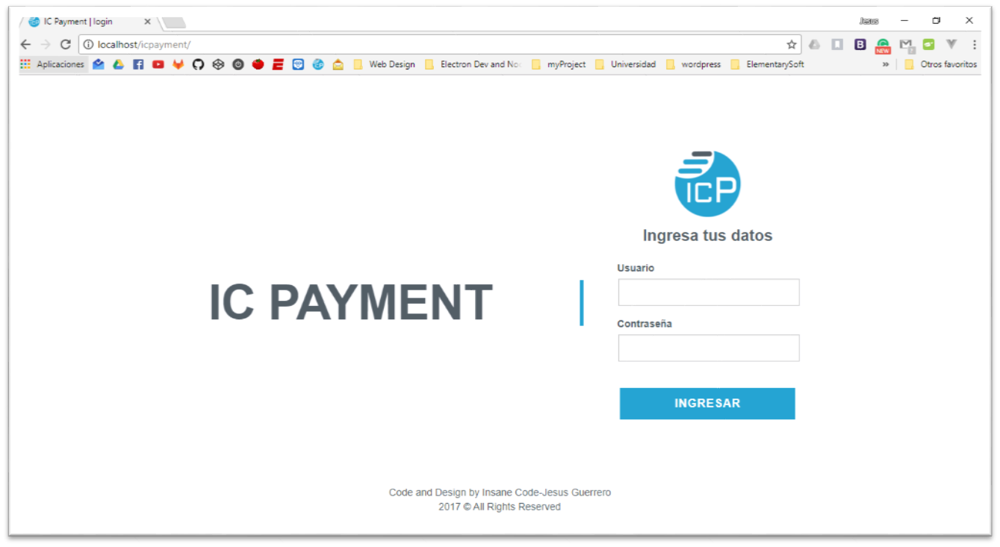
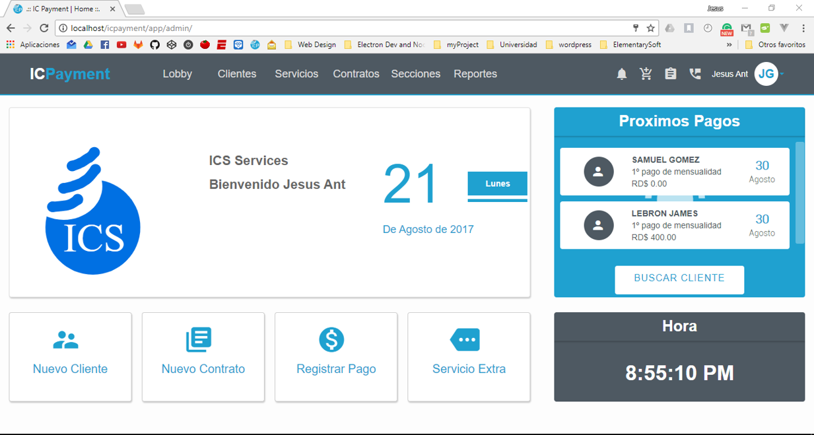
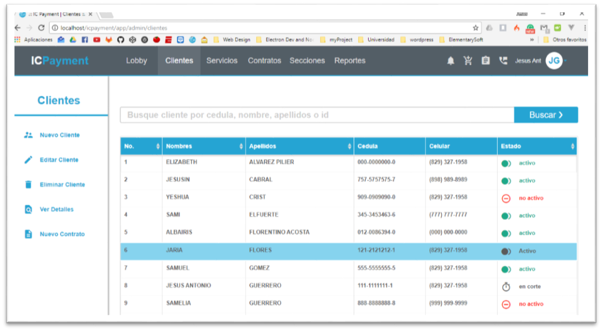

#IC Payment

Es un sistema de facturacion y administracion de una ISP desarrollada en PHP nos enfocamos en la simpleza de uso para un usuario no tecnico y cuenta con una gran variedad de features que complementan a la plicacion base

# Secciones

1. **Login:** sección donde el cliente ingresa su contraseña y su usuario para entrar a la aplicación

2. **Lobby:** es la sección principal desde aquí el usuario tiene acceso a todas las otras funcionalidades, acceso rapido a buscar cliente,proximos pagos, acceso rapido a las opciones que mas se usan agregar cliente, nuevo contrato, registrar pagos

3. **ABMC Clientes:**  Aquí se poedra agregar,borrar modificar y consultar los clientes

4. **ABC Contratos:**  Aquí se podra agregar,borrar, consultar los contratos vigentes , registrar pagos y actualización de servicio(si cambian de modem y otros pequeños detalles) y se genera un contrato para imprimir

5. **C Reportes:** Un reporte general del status de la empresa, contratos activos, cantera de clientes,ingresos por mes

6. **Admin:** Ingresar los detalles de la empresa, que se verán en los recibos, agregar, modificar, borrar y consultar usuarios y sus privilegios.

7. **Registro** de pagos: Se generaran los pagos que debe hacer e cliente a lo largo del contrato, y aquí solo se registrará con solo un click e imprimir el recibo

8. **Impresiones:** Diseño de contrato para impresión, lista de usuarios, contratos etc, diseño de recibo de pagos

9. **Actualización o Cargo Extra:** Actualizaciones menores como cambio de modem, etc se harán por esta via

10. **Caja Chica.** controla el flujo de la caja chica y lleva un registro de todos los movimientos de la caja

11. **Control de averias** registra, actualiza e imprime el listado de averias

12. **Control de secciones y cobertura**

<<<<<<< HEAD:readme.md
# Capturas de pantalla

# Funcionalidades extras

- Reportes Graficas
- SMS a usuarios utilizando la API smsgateway
- Cierres de caja
- Control de ventas/pagos de servicios extras

## Technologias

* HTML/CSS/ JavaScript
* PHP/ Codeigniter
* Vue.js

## License

Copyright (c) Jesus Guerrero. All rights reserved.

=======

# Funcionalidades extras

- Reportes Graficas
- SMS a usuarios utilizando la API smsgateway
- Cierres de caja
- Control de ventas/pagos de servicios extras

TODO:
- 

## Technologies

* HTML/CSS/ JavaScript
* PHP/ Codeigniter
* Vue.js

## License

Copyright (c) Jesus Guerrero. All rights reserved.

>>>>>>> 9083c9d127e65d72fb596d5c1b5ce2e1b9eb7572:readme.md
Licensed under the MIT License.